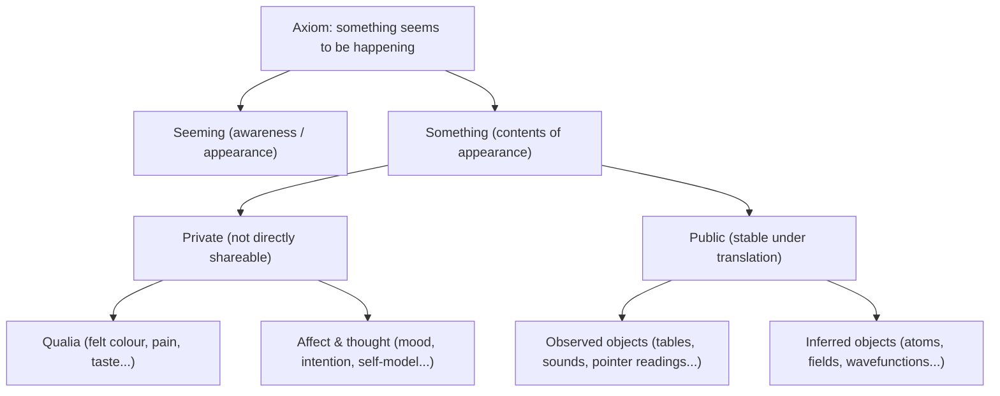

# Reality, Rendered

## Executive summary

I begin with one statement that is exceedingly hard to deny without performing it: **something seems to be happening**. From that axiom I build a minimal “tree of access” that separates **seeming** (the fact of appearance) from **something** (what appears). The “something” naturally divides into **private** contents (pain, blueness-as-felt, moods) and **public** contents (tables, instrument readings, shared measurements). The public domain further divides into what we **observe** and what we **infer**; the private divides into **qualia** (felt sensory character) and **affect/thought** (feelings, intentions, the self-model).

The key claim that follows is not that the world is unreal, but that finite minds and finite sciences must **compress**: we trade micro-detail for predictive power. “Objects” are best understood as **stable compression products**—handles that persist under noise, scale changes, and translation between observers. This is not merely a psychological story. Modern physics routinely formalises the same move via **effective theories** and **renormalisation group** reasoning, and even apparently “fundamental” items such as the proton are treated as **pattern-like entities**, with different effective descriptions at different scales. citeturn2search0turn2search1turn2search2

A central side note (I treat it as a “beast” because it matters) addresses the worry that “if objects are compressions, then anything can be an object”. There are clear, non-arbitrary criteria for **degrees of reality** in emergent descriptions: **compression gain**, **robustness**, **autonomy**, and **intersubjective reproducibility**. These criteria are illustrated twice: (i) via the path integral, where a classical trajectory emerges through **constructive interference** near stationary action; and (ii) via Conway’s Life, where a glider is an emergent “thing” with its own kinematics, despite being nothing but local rule updates underneath. citeturn0search4turn3search1turn0search3

Two “trapdoors” then open. First: if objects are compression handles, then much of “the everyday world” is **reality as rendered**, not necessarily reality in the universe’s native encoding. Second: in statistical mechanics, the arrow of time is defined over **macrostates**—coarse-grained descriptions—and entropy counts microstates consistent with those macrostates, making time’s asymmetry intimately tied to compression and coarse-graining. citeturn0search1turn5search4turn0search2

Finally, the reduction programme hits a hard limit. I can demote chairs, protons, and even time’s arrow to interface-level patterns. I cannot coherently demote **seeming itself**, because every demotion occurs within seeming. That is one way of re-stating the “hard problem” of consciousness: why any physical description should be accompanied by subjective appearance at all. citeturn1search0

I close by laying out two broad hypotheses pressured by this structure: (A) consciousness is **strongly emergent** from a non-mental base (a view with known tensions around causal closure and explanation), or (B) mind-like aspects belong closer to the base layer, making most other “things” weakly emergent compression handles. citeturn3search3turn1search1

## The ontology tree and the reading contract

Before I argue about what reality is, I want to be explicit about what my starting data are. The “tree” below is not an ontology of the universe; it is an ontology of **access**—what I can justifiably talk about starting from the axiom.

I also want the pacing to be honest. The narrative proceeds in Acts; each Act is something like a “consent checkpoint”. Once you agree to the earlier Acts, later Acts become harder to refuse without walking backwards through claims you already conceded.

```mermaid
flowchart LR
  A["Axiom"] --> B["Tree of access"]
  B --> C["Renderer shapes categories"]
  C --> D["Compression principle"]
  D --> E["Physics confirms"]
  E --> F["Degrees of reality (beast side-note)"]
  F --> G["Trapdoor: objects as interface"]
  G --> H["Trapdoor: time/entropy as coarse-graining"]
  H --> I["Hard limit: seeming resists demotion"]
  I --> J["Two hypotheses"]
  J --> K["Landing: emotional reframe"]
```

The rest of this report is written so the main line reads cleanly even if you ignore side notes. Side notes are designed as “wormholes”: optional expansions, widgets, or interactive pages that support a specific step without hijacking the story.

## The Acts

Below I write each Act in a consistent format:

- **Act explanation** (1–2 sentences): what the Act accomplishes.
- **Sub-parts** (3–6): expansions, examples, alternate phrasings, and suggested interactive inserts (including the GIF sequence).

### Act: The axiom

**Explanation:** Establish the smallest unrevokable starting point and split it into the two roles that will drive everything: **seeming** and **something**.

**Sub-part: the root claim**  
I start with a claim so small it refuses to pick sides: **something seems to be happening**. If I deny it, I perform it; denial itself is a kind of seeming. If I doubt it, the doubt is still an appearance. This is not a metaphysical conclusion; it is an accounting rule about what cannot be coherently revoked. The “hard problem” framing later depends on taking this seriously. citeturn1search0

**Sub-part: the first split**  
The axiom contains two components:

- **Seeming**: the fact that anything appears at all.  
- **Something**: the content that appears—sensory fields, thoughts, memories, the felt world.

This split does not yet declare what the “something” is made of. It just keeps track of two different explanatory roles implicit in the axiom. citeturn1search0

**Sub-part: the swap intuition pump (fast and visceral)**  
If I imaginatively swap the **contents**—memories, self-image, mood, sensory field—the world changes dramatically, at varying degrees. If I try to imagine swapping the bare **fact of seeming** while holding contents fixed, nothing about the presentation obviously changes. It is like swapping the existence of the screen versus swapping the frames of the film: most of what I identify as “me” lives in the frames. This is not a proof; it is a stabiliser: it makes the seeming/something distinction feel like lived structure rather than scholastic hair-splitting. citeturn1search0

**Sub-part: alternate phrasings you can reuse**  
- “Appearance is undeniable; interpretation is optional.”  
- “Whatever reality is, it is currently showing up.”  
- “We start from the one fact we cannot performatively disown.”

**Optional widget**  
A playful “axiom tester”: buttons labelled *deny*, *doubt*, *forget*, *dream*. Each returns the same sentence: “Still: something seems to be happening.”

### Act: The tree of access

**Explanation:** Build the taxonomy quickly: private/public, observed/inferred, qualia/affect. This is where the reader tends to nod, because it feels like harmless categorisation.

**Sub-part: private and public**  
The contents of experience divide into two practical kinds.

- **Private**: what is directly accessible only from one perspective (pain, shame, blueness-as-felt).  
- **Public**: what is stable enough that multiple observers can coordinate on it (tables, shared instruments, reproducible readings).

This mirrors how scientific objectivity is operationalised: reproducibility and intersubjective agreement, not metaphysical certainty. citeturn3search9turn3search16

**Sub-part: public splits into observed and inferred**  
The public branch splits again:

- **Observed objects**: what is straightforwardly present in perception or instrument readout.  
- **Inferred objects**: posits introduced to compress, predict, and unify observations (molecules, fields, wavefunctions, spacetime curvature).

This distinction is pragmatic but powerful: it keeps us honest about which nouns are directly encountered and which nouns are theoretical compression handles. citeturn2search0turn2search1

**Sub-part: private splits into qualia and affect/thought**  
The private branch also has internal structure:

- **Qualia**: the felt character of sensation (blueness, warmth, bitterness, sharpness).  
- **Affect & thought**: emotions, moods, inner speech, intentions, the sense of self.

This matters because many philosophical confusions come from sliding between these sub-branches without noticing. The “self” is an especially sticky private content: experientially central, but not obviously fundamental. citeturn1search0

**Sub-part: optical illusions (side note insert)**  
Ambiguous figures give a clean demonstration that “objecthood” is not simply stamped onto the stimulus. The same image can flip between two stable interpretations; nothing external changes, but the perceived “thing” does. This is a standard theme in work on multistable perception and reversible figures. citeturn3search9turn3search16turn3search2

**Side-note teaser copy**  
“**Side note: The ink doesn’t change, but the object does.** Ambiguous figures show that ‘things’ are, in part, outcomes of perceptual organisation.”

**Suggested widget**  
An “illusion gallery” with a timer and a log: “How long until the percept flips?” Add a toggle for hints (symmetry, closure, figure–ground cues). citeturn3search9turn3search16

### Act: The renderer shapes the categories

**Explanation:** Establish that categorisation is not arbitrary, but it is constrained by the hardware and inferential strategy of the observer. This is where the pre-image/image distinction becomes useful.

**Sub-part: perception as inference under constraint**  
A finite organism cannot treat the world as raw pixels. Visual neuroscience and computational models describe perception as a mix of feedforward sensory signals and feedback predictions, with prediction-error signalling playing a central role in influential predictive coding accounts. citeturn5search3turn1search2

Even if you dislike the grandest claims sometimes made for such frameworks, the modest point survives: perceptual “objects” are the result of a constrained inference process, not a neutral recording. citeturn5search3turn1search2

**Sub-part: colour as an example of hardware-shaped experience**  
Colour experience is private, yet not unconstrained. Human trichromacy begins with three cone classes and subsequent neural comparisons; opponent processing is a well-established organisational feature in colour science. citeturn6search4turn6search8

This does not prove that “my blue equals your blue”. It does support a careful inference: if two observers share similar sensory and neural machinery, the structure of their colour discriminations (and plausibly much of the structure of their qualia-space) will be tightly constrained by that machinery. citeturn6search4turn6search8

**Sub-part: pre-image and image**  
Here is the distinction I will keep returning to:

- **Pre-image**: whatever reality is “in itself”, prior to being rendered for a particular observer.  
- **Image**: reality as delivered to a particular observer by their sensory and cognitive interface.

This is not a claim that the pre-image is unknowable in principle; it is an acknowledgement that every act of knowing happens within the image. citeturn1search0turn1search2

**Sub-part: place the split-screen GIF here**  
This is the moment for the visual thesis: different renderings can share the same underlying dynamics.

**GIF placement and caption**  
- **Split-screen GIF (perceived blur vs underlying grid):** place at the end of this Act.  
  Caption: “**Same process, two descriptions.** The left is what the visual system can stably track; the right is a lower-level dynamics the eye never sees.”

**Suggested interactive widget**  
A toggleable overlay: “show underlying grid / hide grid” paired with a blur slider. The blur slider is effectively a knob for “observer resolution”.

### Act: Compression is why objects exist at all

**Explanation:** Provide the engine. Limited systems compress; objects are compression outputs. The guiding principle is a trade-off between complexity and predictive power.

**Sub-part: compression as an epistemic necessity**  
When a system cannot store or compute over all details, it must summarise. This is not just a metaphor. It is a general constraint on modelling and prediction: to predict effectively with finite resources, one must discard information that is irrelevant to the task. This is the philosophical backbone behind formal ideas like the minimum description length (MDL) principle, which treats good theories as those that compress data without losing predictive adequacy. citeturn6search7turn1search3

**Sub-part: complexity × predictive power**  
In my own shorthand, the mind searches for descriptions that are:

- simple enough to be usable (low complexity),  
- rich enough to forecast and control (high predictive power).

MDL offers a rigorous cousin of this intuition: minimise total description length of model plus data residuals, balancing fit against complexity. citeturn6search7turn1search3

**Sub-part: “a thing” as a stable, useful chunk**  
A “thing” is a stable summary that supports successful prediction and action at the observer’s scale. It is a handle. It is a noun that earns its keep.

**Alternate phrasings**  
- “Objects are the UI elements of experience.”  
- “A chair is a successful summary.”  
- “We live in the rendered layer because it is the only layer we can handle.”

**The GIF ladder belongs here (the core visual argument)**  
This is your narrative’s visual centrepiece. It operationalises “levels of description” without asking the reader to trust words.

**Exact GIF placements and captions**

- **GIF one (blurry ant across white):** place at the start of this Act.  
  Caption: “At this resolution, you see an ‘ant’: a moving thing with persistent identity.”

- **GIF two (largest zoom-in: huge squares flashing):** immediately after introducing “zoom in dissolves the object”.  
  Caption: “Zoom in far enough and the ‘thing’ dissolves into local state changes.”

- **GIF three (slightly zoomed out: vague moving regularity):** right after “patterns require context”.  
  Caption: “With a little context, a pattern begins to cohere.”

- **GIF four (further out: clear glider):** after defining “thing = stable summary”.  
  Caption: “Now the pattern earns objecthood: it persists, moves, and can be modelled.”

- **GIF five (blurred version, resembles ant):** before you transition to “interface”.  
  Caption: “Blur micro-detail and the handle returns—almost unchanged to the eye.”

- **GIF six (morph: blurred squares → blurred ant):** the closing punch of this Act.  
  Caption: “Same image, different ontology: at this resolution your interface cannot tell which story is fundamental.”

**Suggested widget**  
A single continuous zoom slider: “grid → glider → blur”, with a toggle for “show underlying rules”.

### Act: Physics confirms the strategy

**Explanation:** Show that compression and scale-dependent description are not merely psychological. Physics itself is built out of effective descriptions, and it formalises “forgetting details” with extraordinary precision.

**Sub-part: effective field theory is formalised coarse-graining**  
In effective field theory, one uses the degrees of freedom appropriate to a scale and integrates out (or otherwise systematically ignores) high-energy detail not needed for low-energy predictions. This is not an admission of defeat; it is a methodological principle, articulated clearly in foundational EFT discussions. citeturn2search0

**Name this once, then move on**  
entity["people","Howard Georgi","physicist eft"]’s review-style exposition is a canonical entry point: EFT is presented as a way to do physics that respects scale separation and predictive sufficiency, not as a mere approximation born of ignorance. citeturn2search0

**Sub-part: renormalisation group as “how descriptions change with scale”**  
Renormalisation group methods make the scale-dependence explicit: parameters and effective interactions “flow” when you change resolution. The classic discussion by Wilson and Kogut is often cited as a foundational synthesis of these ideas across statistical mechanics and quantum field theory. citeturn2search1

**Sub-part: protons as patterns across scales**  
At everyday energies, “proton” behaves like a stable particle-like unit. At higher resolution, deep inelastic scattering reveals scale-dependent structure functions and partonic substructure; the proton is described via distributions of quarks and gluons whose behaviour depends on the probing scale. This is standard physics, documented in the Particle Data Group’s review material. citeturn2search2

Here I’ll name the source once: entity["organization","Particle Data Group","review collaboration"]. citeturn2search2

**Sub-part: why this supports the earlier Acts**  
Physics does not merely tolerate multiple ontologies. It requires them. The same underlying reality supports different effective “things” depending on scale and question. This tells us that treating objects as compression handles is not anti-scientific; it is one way of describing what science already does. citeturn2search0turn2search1turn2search2

### Act: Degrees of reality

**Explanation:** Prevent the “so anything goes” misunderstanding. Not all emergent descriptions are equally legitimate. There are clear criteria for when an emergent “thing” is more thing-like than an arbitrary grouping.

**Sub-part: the problem of arbitrary nouns**  
I can define a “thing” as “this glass plus that aircraft”. But the fact that I can coin a noun does not mean the noun tracks a robust structure in the world or in our best models. The crucial question becomes: **which emergent objects earn their status?**

**Sub-part: the four-part rule for ‘more real’ emergent things**  
An emergent description is more thing-like insofar as it has:

1. **Compression gain**: large predictive payoff with fewer parameters.  
2. **Robustness**: persistence under perturbation and noise.  
3. **Autonomy**: approximately closed, reusable dynamics at its own level.  
4. **Intersubjective reproducibility**: stable identification across observers, instruments, and modelling choices.

This resonates strongly with the idea of “real patterns” defended by Daniel Dennett: patterns are real to the extent that tracking them yields predictive power unavailable at less abstract levels. I’ll name this once: entity["people","Daniel Dennett","philosopher cognitive science"]. citeturn0search3

**Sub-part: a checklist table you can reuse on the site**

| Criterion | Operational question | Why it matters |
|---|---|---|
| Compression gain | Does it let me predict much with little? | Filters arbitrary groupings from useful handles. citeturn6search7 |
| Robustness | Does the identity survive noise/perturbation? | Protects the “thing” from micro-variance. citeturn0search2 |
| Autonomy | Are there effective laws at this level? | Makes the thing reusable without microscopic simulation each time. citeturn2search0turn2search1 |
| Intersubjective reproducibility | Do different observers converge on it? | Upgrades private whim into public objecthood. citeturn3search9turn3search16 |

**Sub-part: path integrals and stationary phase (why classical trajectories ‘win’)**  
In the path integral formulation, quantum amplitudes are obtained by summing contributions from alternative histories (paths), each weighted by a phase related to the action. In regimes where the action is large compared with Planck’s constant, the contributions from wildly different paths tend to interfere destructively, while paths near stationary action contribute coherently, yielding classical behaviour in an appropriate limit. This is part of the standard motivating arc in Feynman’s 1948 formulation. citeturn0search4turn0search8

I’ll name him once: entity["people","Richard Feynman","physicist path integral"]. citeturn0search4turn0search8

**Interpretive payoff (the “clear rule” you wanted)**  
This gives a concrete sense in which some macroscopic patterns are not arbitrary: they are selected by a stability filter built into the dynamics (constructive reinforcement vs cancellation). “Classical motion” is, in this sense, what survives summation. citeturn0search4turn0search2

**Sub-part: Life gliders (a toy universe where objecthood is visible)**  
In Conway’s Life, the substrate is nothing but local updates on a grid. Yet certain patterns (gliders, oscillators, guns) recur, persist, and exhibit quasi-object behaviour. Gardner’s 1970 Scientific American column introduced Life and drew attention to its surprising repertoire of stable and long-lived patterns. citeturn3search1

I’ll name the key figures once each: entity["people","John Horton Conway","mathematician cellular automata"] and entity["people","Martin Gardner","math populariser"]. citeturn3search1

**Suggested interactive widget (this is the “beast” side note made tangible)**  
An on-page Life simulator with:

- preset patterns (glider, oscillator, Gosper gun),  
- a zoom slider (cell-level → pattern-level),  
- a blur slider (pattern → “ant-like blob”),  
- a “thing-likeness score” based on the four criteria.

All of this is grounded in the public historical record of Life’s emergence as a research and hobby ecosystem. citeturn3search1turn3search15

**Sub-part: the unreasonable effectiveness of mathematics**  
Why does mathematics latch onto these structures so well? One plausible answer is selection: we keep models that compress and predict. But the deeper puzzle remains compelling, and Wigner’s classic essay is still the reference point for stating it sharply. I will name him once: entity["people","Eugene Wigner","physicist nobel laureate"]. citeturn2search3

This side note can host the “invented vs discovered” question without forcing a verdict: perhaps the *languages* are invented, but the *invariants* they capture are discovered. citeturn2search3turn0search3

### Act: Trapdoor one

**Explanation:** Cash out what the reader has already accepted: if objects are compression products, then objecthood is interface-dependent. This is not nihilism; it is an ontological reclassification.

**Sub-part: the trapdoor argument (compact form)**  
1) Finite systems compress.  
2) Compression yields stable handles.  
3) Those handles are what we call objects.  
Therefore, objecthood is—at least partly—a property of the image (reality-as-rendered), not obviously a primitive property of the pre-image.

Nothing here denies an external reality. It denies that our everyday noun-inventory is guaranteed to be the universe’s native inventory.

**Sub-part: public reality as “stable under translation”**  
The public world becomes: the subset of renderings that remain stable across many observers with similar renderers, plus the disciplined instrumental practices that increase stability (measurement protocols, calibration, replication). This is consonant with how science actually earns intersubjective authority. citeturn2search0turn5search3

**Sub-part: place GIF five and GIF six as callbacks**  
At this point, re-show the blur/morph to make the trapdoor felt.

- **GIF five (blurred glider → ant-like):**  
  Caption: “The handle survives; the substrate story changes.”

- **GIF six (morph):**  
  Caption: “Your experience is compatible with multiple micro-ontologies at this resolution.”

**Sub-part: side note insert—“not fundamental” ≠ “not real”**  
Dennett’s point about patterns helps here: a pattern can be real insofar as it supports reliable prediction and explanation—even if it is not fundamental furniture. citeturn0search3

### Act: Trapdoor two

**Explanation:** Apply the same compression logic to time. The arrow of time is most clearly defined over coarse-grained macrostates and entropy; it is not obviously written into micro-dynamics as a primitive “flow”.

**Sub-part: macrostates are coarse-grained descriptions**  
In statistical mechanics, a macrostate is specified by a comparatively small set of macro-variables (pressure, temperature, density profiles, etc.). This is not pedantry; it is the whole point: macrostates summarise astronomical micro-detail into variables that allow tractable prediction. Gibbs’ foundational treatment of ensembles is a historical anchor for this style of reasoning. I will name him once: entity["people","Josiah Willard Gibbs","physicist statistical mechanics"]. citeturn0search1turn0search5

**Sub-part: entropy counts microstates under a macro-label (Boltzmannian picture)**  
Boltzmann entropy is commonly understood (in modern expositions) as the logarithm of the phase-space volume corresponding to a macrostate. Goldstein and Lebowitz articulate this explicitly while analysing nonequilibrium systems and the role of macro-variables in defining entropy. citeturn5search4turn0search2

I will name the historical origin once: entity["people","Ludwig Boltzmann","physicist statistical mechanics"]. citeturn5search4

**Sub-part: why the arrow appears at the macro-level**  
Lebowitz’s classic discussion emphasises that time-asymmetric macroscopic equations (diffusion, hydrodynamics) can be derived—sometimes rigorously—from reversible micro-dynamics by exploiting the scale separation between micro and macro, plus typicality and special boundary conditions. citeturn0search2turn0search6

I will name him once: entity["people","Joel Lebowitz","physicist statistical mechanics"]. citeturn0search2turn0search6

**Sub-part: the careful claim (what I am and am not saying)**  
I am not saying “time is fake”. I am saying:

- the *directionality* of time, as used in physics, is naturally articulated in a coarse-grained vocabulary;  
- entropy is defined relative to coarse-graining choices (macro-variables);  
- therefore, the arrow is at least partly a feature of how we describe, track, and compress change.

This is why the arrow-of-time discussion is inseparable from the choice of macrostates. citeturn5search4turn0search2

**Suggested interactive widget**  
A microstate animation (particles in a box) with a macrostate toggle (“left/right density”, “temperature gradient”) and an entropy counter, explicitly showing how many microstates correspond to a macro-description. citeturn5search4turn0search1

### Act: The hard limit

**Explanation:** Show where the demotion strategy stops. Objects and time’s arrow can be treated as patterns in compressed descriptions; **seeming itself** cannot be eliminated without using it, which is the core pressure behind the hard problem.

**Sub-part: the interface cannot fit inside itself**  
I can model chairs as patterns, protons as effective entities, and even the arrow of time as a macro-level phenomenon. But when I try to model **seeming** as “just another object”, the move becomes self-referential: the model is itself an appearance. Chalmers’ classic framing isolates this stubborn residue as the “hard problem”: why there is subjective experience at all, not merely why we can discriminate, report, and behave. I will name him once: entity["people","David Chalmers","philosopher consciousness"]. citeturn1search0

**Sub-part: mental causation and the exclusion pressure**  
The moment I insist that consciousness is “real”, I am tempted to insist it is causally efficacious. But the philosophy of mind literature contains a well-known tension: if physical causes are sufficient, do mental causes get excluded, or do they overdetermine? The Stanford Encyclopedia’s survey of mental causation and the exclusion problem is a concise map of this terrain. citeturn5search1turn5search5

**Sub-part: the DNA objection (a serious reader’s resistance)**  
Here is the objection I think a careful reader should raise:

“Fine—chairs might be compression handles. But DNA replication is a mechanistic cascade with information-rich structure: polymerases, proofreading, replisomes, coordinated kinetics. How can you tell me this is ‘just description’ while the micro-laws are the only reality?”

This objection is powerful because biology feels like the paradigm case of organised causation. DNA replication mechanisms and proofreading are well-characterised and undeniably real as a scientific target. citeturn6search5turn6search1

**Sub-part: reply—pattern reality without new fundamental forces**  
My reply is to separate two senses of “real”:

- DNA and its machinery are real as **robust, reproducible patterns** and organisational regimes.  
- That does not automatically imply they are real as **additional fundamental causal ingredients** beyond the micro-physics.

Weak emergence captures this: macro-properties can be derivable in principle (often only by simulation) and explanatorily indispensable, yet not require new fundamental forces. Bedau’s articulation of weak emergence explicitly treats emergence as compatible with dependence on micro-dynamics while preserving explanatory novelty. I will name him once: entity["people","Mark Bedau","philosopher emergence"]. citeturn1search1

Biological organisation can exert what looks like “top-down influence” by imposing **constraints** that channel micro-interactions into narrow functional pathways—without violating micro-causal closure. The exclusion debate is precisely about how to make sense of this without incoherence. citeturn5search1turn5search5

**Sub-part: computational irreducibility as a pressure-release valve**  
Even if micro-laws are simple, the dynamics they generate can be so computationally rich that prediction is effectively unshortenable: the only way to find out is to run the system. Wolfram calls this “computational irreducibility” and uses it to argue that many systems cannot be shortcut-computed in general. I will name him once: entity["people","Stephen Wolfram","computer scientist"]. citeturn4search0turn4search8

This does not prove free will. It does soften a naïve “clockwork universe” intuition that equates determinism with foreknowledge and compressibility. citeturn4search0turn4search1

**Side-note teaser copy**  
“**Side note: Deterministic doesn’t mean compressible.** Some futures can only be reached by living them.”

### Act: Two hypotheses

**Explanation:** After the hard-limit Act, the story should not end in a fog. The structure pressures us into two broad hypotheses about the relation between consciousness and the physical world.

**Hypothesis: strong emergence from a non-mental base**  
On this view, base reality is non-mental, and consciousness arises as a genuinely novel feature—not merely a useful description. This is what the emergence literature calls **strong emergence**, and it is widely recognised as philosophically costly because it threatens causal closure and invites questions about how radically new properties could arise without new laws. The Stanford Encyclopedia’s emergence entry is explicit about the compatibility differences between strong and weak emergence and how strong emergence tends to conflict with physicalist closure. citeturn3search3

**Hypothesis: mind-like aspects closer to the base**  
On this view, the hard problem dissolves structurally: we stop trying to produce experience from what is wholly non-experiential. Many versions of this stance exist (and they do not all collapse into full-blown idealism). The key point in my framework is modest: if mind-like aspects are closer to the base, then most higher-level “things” can remain weakly emergent handles, while consciousness is not an ontological bolt-on. citeturn1search1turn1search0

**Side corridor: quantum measurement and consciousness (keep it disciplined)**  
Speculation often gathers around quantum measurement. It is fair to say there is a genuine measurement problem and multiple serious interpretive camps (Everett-style, collapse models, Copenhagen-style families, etc.). The Stanford Encyclopedia’s measurement entry provides a sober overview of the issues without endorsing a consciousness-based collapse story. citeturn5search2turn5search14turn5search18

**Side corridor: Gödel/Penrose (explicitly labelled speculative and contested)**  
A different speculative corridor argues that human mathematical understanding is not fully captured by Turing computation. Penrose defends versions of this claim and responds to critics in his 1996 Psyche paper; Feferman’s critique is one of the most cited careful objections to Penrose’s Gödelian argument. I will name them once each: entity["people","Roger Penrose","mathematical physicist"] and entity["people","Solomon Feferman","logician"]. citeturn7view0turn4search3

If you host this on your site, the honest framing is: “Here is the argument, here is the critique, nothing here settles the metaphysics of mind.” citeturn7view0turn4search3turn4search10

**Free will options (best treated as downstream bookkeeping)**  
Free will debates often become interminable because they mix questions about alternatives, reasons-responsiveness, moral responsibility, and metaphysical possibility. A disciplined approach is to present free will as depending on what you take possibility to be and what causal story you accept. The Stanford Encyclopedia offers clear taxonomies: the broad free will entry, compatibilism, and incompatibilist theories are good anchors for your side page. citeturn4search1turn4search17turn4search9

**Suggested free-will side-note structure (three doors, no verdict)**  
- Compatibilist: freedom as reasons-responsive agency within determinism. citeturn4search17  
- Incompatibilist/libertarian: freedom requires genuine alternative possibilities or agent causation. citeturn4search9turn4search13  
- Deflationary/illusionist: “free will” as a useful self-model for deliberation and coordination.

## Side-note inserts, widgets, and the GIF system

This section is a build sheet for your website: concise implementable inserts with teaser copy that does not break the main rail.

### Side-note mapping table

| Side-note / widget | Anchor Act | Teaser copy | Core sources |
|---|---|---|---|
| Optical illusions gallery | Tree of access | “The ink stays fixed; the object flips.” | Multistable perception reviews and analyses. citeturn3search9turn3search16 |
| Life simulator with zoom/blur | Degrees of reality / Compression | “An entity appears without being added to the rules.” | Gardner’s 1970 article; historical notes on glider guns. citeturn3search1turn3search15 |
| Computational irreducibility explainer | Hard limit | “Deterministic doesn’t mean shortcut-predictable.” | Wolfram’s account and examples. citeturn4search0turn4search8 |
| Free will options page | Two hypotheses | “Free will is a bundle; pick which thread you mean.” | SEP free will + compatibilism/incompatibilism entries. citeturn4search1turn4search17turn4search9 |
| Gödel/Penrose corridor | Two hypotheses | “Understanding beyond computation? Here’s the argument and the critique.” | Gödel translation + Penrose reply + Feferman critique. citeturn4search10turn7view0turn4search3 |
| DNA objection page | Hard limit | “If emergent things aren’t fundamental, why does biology feel causally real?” | DNA replication and proofreading sources + emergence framing. citeturn6search5turn1search1 |
| Entropy sandbox | Trapdoor two | “The arrow appears when you summarise.” | Gibbs + Goldstein/Lebowitz + Lebowitz arrow-of-time discussion. citeturn0search1turn5search4turn0search2 |

### GIF system blueprint

| Asset | Placement | Caption copy |
|---|---|---|
| GIF one (blurry ant) | Compression Act opener | “At this resolution, you see a moving thing.” |
| GIF two (cell zoom-in) | Compression Act, after “zoom dissolves” | “Zoom in: the thing becomes local updates.” |
| GIF three (mid zoom) | Compression Act, after “context” | “Context reveals structure.” |
| GIF four (clear glider) | Compression Act, after “objecthood” | “A stable pattern with its own dynamics.” |
| GIF five (blurred glider) | Trapdoor one | “Blur away micro-ontology; the handle remains.” |
| GIF six (morph to ant) | Compression climax or Trapdoor one | “Same image, different underlying story.” |
| Split-screen (blur vs grid) | Renderer Act | “Two levels: what you track vs what underlies it.” |

## Glossary and source anchors

### Glossary of key terms

| Term | Working definition here | Source anchors |
|---|---|---|
| Seeming | The fact of appearance; that experience is occurring. | Hard-problem framing. citeturn1search0 |
| Private | Contents not directly inspectable by multiple observers. | Multistable perception literature as a clue about internal organisation. citeturn3search9 |
| Public | Contents stable under translation/coordination between observers. | Predictive coding + intersubjective practice. citeturn5search3turn2search0 |
| Coarse-graining | Many microstates mapped to one macro-description (non-bijective “forgetful” map). | Statistical mechanics foundations. citeturn5search4turn0search1 |
| Weak emergence | Novel, explanatorily indispensable macro-patterns derivable in principle (often only by simulation). | Bedau. citeturn1search1 |
| Strong emergence | Genuinely novel properties with new causal powers, typically in tension with closure. | SEP emergent properties. citeturn3search3 |
| Effective theory | A model valid at a domain/scale with appropriate degrees of freedom; details integrated out. | Georgi + Wilson/Kogut. citeturn2search0turn2search1 |
| Entropy (Boltzmannian) | Logarithm of phase-space volume corresponding to a macrostate. | Goldstein & Lebowitz. citeturn5search4 |
| Hard problem | Why any physical/informational story is accompanied by subjective experience. | Chalmers. citeturn1search0 |
| Epiphenomenalism | Mental events caused by physical events but causally inert with respect to the physical. | SEP epiphenomenalism. citeturn6search2 |

### Primary and authoritative sources used in this report

I list these as “anchors”: they are the load-bearing citations for the central moves.

- Feynman’s original 1948 path integral formulation. citeturn0search4turn0search8  
- Gardner’s 1970 Scientific American column introducing Life. citeturn3search1  
- Georgi on effective field theory. citeturn2search0  
- Wilson & Kogut on renormalisation group reasoning. citeturn2search1  
- Particle Data Group review material on structure functions / proton substructure. citeturn2search2  
- Gibbs’ *Elementary Principles* as a historical anchor for ensemble thinking. citeturn0search1turn0search5  
- Goldstein & Lebowitz on Boltzmann entropy of nonequilibrium systems. citeturn5search4  
- Lebowitz on Boltzmann entropy and time’s arrow. citeturn0search2turn0search6  
- Chalmers on the hard problem. citeturn1search0  
- Bedau on weak emergence. citeturn1search1  
- Dennett on real patterns. citeturn0search3  
- Rao & Ballard on predictive coding; Friston on the free-energy principle. citeturn5search3turn1search2  
- Stanford Encyclopedia entries on emergence, mental causation, measurement, free will, compatibilism. citeturn3search3turn5search1turn5search2turn4search1turn4search17  
- Gödel translation; Penrose reply; Feferman critique (speculative corridor with critique included). citeturn4search10turn7view0turn4search3  
- NCBI Bookshelf chapters on colour vision and DNA replication (for the hardware and biology objection). citeturn6search4turn6search5
